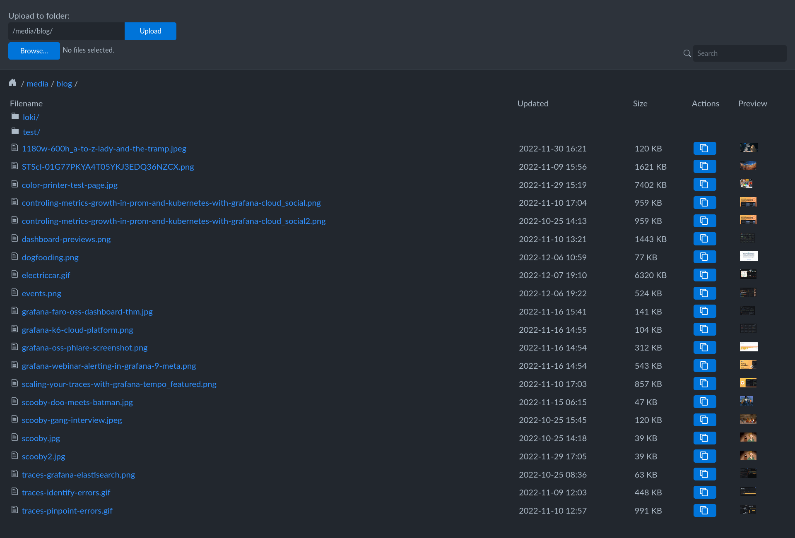

# Object Storage UI (WIP)

A browser interface for GCS.

To run:
- `export GOOGLE_APPLICATION_CREDENTIALS="/path/to/key.json"`
- `go run main.go --bucket-name staging-static-grafana-com --allow-upload`

```
Options (need to be in order):
      --bucket-name <value>    The name of the bucket to serve
      --port <port>            Specify port to listen on [default: 3000]
      --path-prefix <path>     Specify a path prefix
      --domain-prefix <domain> Specify a domain prefix
      --allow-upload           Allow upload
      --allow-delete           Allow delete
      --allow-search           Allow search
```

